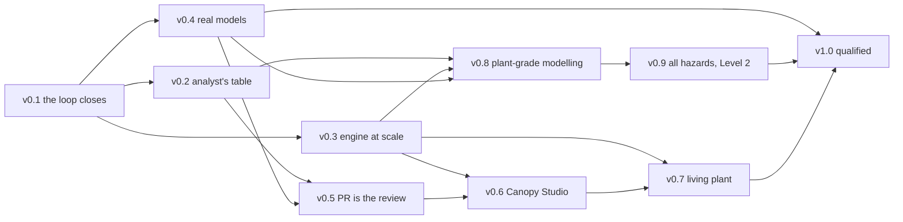

# Canopy roadmap

*As of 2 September 2026. Grounded in the `Canopy` repository: `main` at `62fe89e`, tag `v0.1.0` (10 Jul 2026, 13 commits since), `docs/limitations.md`, `docs/verification-validation.md`, and the agreed priorities in `CLAUDE.md`. Milestones are sequenced by dependency, not date.*

*Revised 24 September 2026: canonical YAML writer and SQL projection added to v0.4, with the matching Studio note and open decisions. Parity with RiskSpectrum, SAPHIRE and CAFTA planned through a hybrid quantification path (v0.3), SAPHIRE and CAFTA import (v0.4), outage-schedule risk profiles (v0.7), two new milestones (v0.8 plant-grade modelling; v0.9 all hazards, all states, Level 2), an ecosystem block in v1.0, a parity map and three open decisions. Existing milestone numbers are unchanged.*

## Where the code stands (v0.1.x)

The repository closes the whole git-native loop on a PWR fragment (three fault trees, one event tree, 13 basic events pre-CCF): YAML format with immutable prefixed IDs, structured formulas, mandatory units and provenance; a validator (strict parse, JSON Schema, reference linter); a Rust ROBDD engine (exact P(top), Rauzy minimal cut sets, Birnbaum, k-of-n, NOT/XOR with cut-set refusal, event-tree sequences with negated success branches, CCF alpha/beta expansion); CI that quantifies head and base and posts a risk-delta PR comment; MEF export and fault-tree import with a 12-digit round trip; a self-contained HTML viewer; and a living V&V report (18 FR, 2 NFR, six validation legs, Aralia 41/43 exact vs SCRAM, demo CDF 2.2082e-8 /yr matched by an independent oracle). Post-tag: Apache-2.0 licence, `rate-periodic-test` failure model, CCF cap of 8, consequence report (pooled MCS + cut-set Fussell–Vesely).

Absent, per `docs/limitations.md`: uncertainty propagation, dynamic variable ordering, garbage collection, prime implicants, followed transfers, component templating, event-tree/CCF import, a visual diff, an editor, any live-plant connection.

Suggested housekeeping: tag `v0.1.1` from `main` so the V&V "version under report" catches up.

## At a glance

- **Now (v0.2 → v0.3)** — every number a commercial code prints, then an engine safe at plant scale and inside a long-lived process.
- **Next (v0.4 → v0.5)** — real models in without copy-paste, plus an SQL working copy that round-trips to YAML; the pull request becomes the review surface.
- **Later (v0.6 → v0.7)** — Canopy Studio and the living-plant risk monitor for the digital twin.
- **Parity (v0.8 → v0.9)** — the modelling breadth of RiskSpectrum, SAPHIRE and CAFTA: plant-grade Level 1 constructs, then fire, flood, seismic, shutdown states and Level 2. Needs only v0.2–v0.4, so it runs in parallel with Studio and the living plant; for competing with the incumbents it matters more than either.
- **Gate (v1.0)** — full-scope capability plus the organisational V&V and support that earn a licensing-grade classification.

Every milestone ends with a git tag, the V&V report updated in the same change set, the property harness and SCRAM cross-check extended to the new constructs (where SCRAM has no equivalent, as for HRA, hazards and Level 2, an independent oracle and a side-by-side run in an incumbent code take its place), and the matching `limitations.md` entries deleted.

## v0.2 — The complete analyst's table (now; builds on v0.1 only)

Goal: every result a reviewer expects from RiskSpectrum or CAFTA, on the existing O(|BDD|) probability pass, without touching the BDD core.

Uncertainty propagation first (distributions are already parsed and schema-validated): Monte Carlo over the BDD, sampling each `PAR-` once per iteration and applying it to every referencing basic event (state-of-knowledge correlation for free); mean/median/5th/95th per sequence and per metric; seeded for bit-for-bit reproducibility. Also: BDD-exact consequence-level importance (Birnbaum, FV, RAW, RRW summed frequency-weighted across sequences, replacing the cut-set approximation); event-tree transfers followed into the target tree; partition lint (Σ P = 1) on the committed model; dimensional algebra collected in one place in the validator; a single `canopy` CLI (`validate`, `quantify`, `report`, `compare`, `viz`).

Exit: percentile CDF on the demo model regenerates from tag + seed; harness checks sampled means against closed-form means; FR-19…FR-22 added with traceability; three limitations entries removed; PR comment shows ΔCDF with a 5–95% band and importance re-ranking.

## v0.3 — Engine at scale (now; prerequisite for v0.6 serve mode, v0.7 and v0.8)

Goal: clear the das9701 boundary; make the engine fit for a process that runs for days; quantify full-scope models that no exact method can hold in memory.

Garbage collection first (mark-and-compact over the node arena with index remapping), then the shared manager: each functional-event top compiled once per house configuration and reused across all sequences, removing per-sequence recompilation. Dynamic reordering (Rudell sifting, triggered on node-count growth). Prime implicants via Coudert–Madre meta-products for non-coherent cut sets. A benchmark job tracking Aralia wall time and peak node count per PR (reporting, not gating).

Hybrid quantification, the path every incumbent relies on at full scope (RSAT, FTREX, SAPHSOLVE). Exact BDD stays the default wherever it fits under the node cap; beyond it, a truncated minimal-cut-set path with absolute and relative cut-offs, quantified by an exact BDD rebuilt over the retained cut sets, which removes the rare-event and min-cut-upper-bound overcount that matters for high-probability events such as seismic failures. Every reported figure carries its method, cut-off and a truncation-error estimate, and the PR comment flags any change that moves a result from exact to truncated. Sequences quantified in parallel.

Exit: das9701 quantified under the memory cap and agreeing with SCRAM (42/43); harness asserts GC on/off identity and prime-implicant set equality against a brute-force oracle; an engine-only PR reports "quantitatively neutral" across the demo model and all 43 Aralia trees; hybrid mode completes on synthetic full-scope-sized models (at least 10,000 basic events and 20,000 gates, generated like the trees in published engine benchmarks such as the 2024 INL / NC State SAPHSOLVE–FTREX–XFTA–SCRAM study), and on every tree where exact BDD also completes, the gap to the exact result stays within the reported truncation-error estimate.

## v0.4 — Real models in, real models out (next; independent of the engine milestones)

Goal: a plant-scale model — thousands of basic events, identical trains, several units — can be authored in Canopy or brought in from an existing tool without copy-paste.

Component templating: a `templates:` mapping of parameterised sub-models instantiated with an ID prefix and parameter bindings, expanded deterministically by the loader, plus `canopy expand` to emit the flat model for review; expansion joins the property harness (expanded train ≡ hand-written train). MEF import extended to event trees, CCF groups, parameter expressions (full round trip). The RiskSpectrum import path (converter, cross-check and extractor skeleton exist; the first real export and its cross-check are what remain). SAPHIRE (through its MAR-D text export) and CAFTA (fault-tree and basic-event files) import on the same pattern, each with a by-ID cross-check of quantified results against the source code, so a model from any of the three incumbents enters Canopy with evidence that nothing changed in transit. Time-phased missions and imperfect test coverage. Release categories as first-class end states, LERF as a manifest metric. A `canopy migrate` tool giving the existing `schema_version` field teeth (a published migration for every step).

Canonical YAML writer and SQL projection. Git remains the only source of truth; SQL (Structured Query Language) is a derived, editable working copy of one commit, never a second master. First a canonical serialiser (fixed key order, quoting and number formatting) such that `dump(load(yaml))` is byte-identical for every committed model; it becomes the single write path for `canopy migrate`, `canopy expand`, the RiskSpectrum importer and, later, Studio. On top of it, `canopy sql load` projects a commit into an SQLite database (tables keyed by the existing immutable IDs, table definitions generated from `psa-model.schema.json` so the two cannot drift, foreign keys and `CHECK` constraints mirroring the reference linter and unit rules), and `canopy sql dump` writes it back as canonical YAML, so bulk edits and ad-hoc queries made in SQL return as an ordinary git diff and PR, with the full validator and risk-delta comment unchanged. The database is never committed: it lives under a git-ignored `.canopy/cache/<commit>/`, keyed by commit hash and rebuilt in seconds (even a full-scope model is tens of megabytes of YAML). Quantification results for that commit (minimal cut sets, sequence frequencies, importance tables) load into the same cache for RiskSpectrum-style querying, which is where SQL pays off most. The same projection serves as the staging area for the RiskSpectrum import (extractor → SQL → canonical YAML). How it treats templates and whether shared servers are supported are open decisions below.

Exit: a public reference model well beyond the fragment validates, quantifies, round-trips through MEF and becomes the second regression fixture; SCRAM's bundled event-tree examples import and cross-check; a per-system `CODEOWNERS` example ships with it; the property harness asserts YAML → SQL → YAML byte identity and identical quantification from YAML-loaded and SQL-loaded models, on the demo, the reference model and randomly generated models; an SQL-side bulk edit on the reference model reaches a merged PR through `canopy sql dump`; CI fails if a database file is ever committed; at least one SAPHIRE and one CAFTA model import and match their source code's results by ID (privately where the model cannot be redistributed).

## v0.5 — The pull request is the review (next; builds on v0.2 and v0.4)

Goal: a reviewer can approve or reject a model change from the PR alone.

Viewer base-vs-head visual diff, viewport culling and minimap; viewer and docs deployed to GitHub Pages per tag; PR comment links into the diff view and carries the uncertainty band and importance re-ranking; a documentation generator assembling report appendices (basic-event, CCF, sequence tables) from provenance blocks as derived artifacts; JSON Schema published for the VS Code YAML extension plus snippets.

Exit: a model-only PR on the reference model reviewable end to end from the comment and hosted diff viewer; docs and viewer live at a tag URL; generated appendices match the committed model on every CI run.

## v0.6 — Canopy Studio (later; builds on v0.3 if served, and v0.5)

Goal: an analyst who never opens a terminal can change a failure rate with a justification, see the risk impact, and submit it for review.

The interface and branding already designed become software: a browser app over git — pick a branch, edit entities through forms that make provenance impossible to skip, live validation, quantify, open the PR. The CI pipeline and v0.5 review flow stay unchanged. Flat sequence table remains the source; the staircase becomes an editable rendering. Architectural fork: WebAssembly build of the engine in the browser (no server, offline) versus `canopy serve` (central, needs v0.3 GC). Either way, Studio can edit a per-branch v0.4 SQL projection and write back only through the canonical YAML writer.

Exit: end to end without a terminal (open Studio → change a rate with justification → PR → CI posts ΔCDF → merge); Studio never writes a derived artifact into the repo.

## v0.7 — The living plant (later; builds on v0.3 and v0.6)

Goal: the reactor digital-twin dashboard reports instantaneous risk for the plant's actual configuration, reproducibly.

Keep house events as BDD variables and restrict at query time instead of folding them at compile time (harness asserts restrict ≡ fold for random configurations); time-dependent unavailability evaluated at a moment t; configuration risk metrics (instantaneous CDF, ICCDP over a window, allowed-outage-time signalling) served to the dashboard, plus risk profiles over a planned outage or maintenance schedule, as RiskWatcher and EOOS provide (a schedule is an ordered list of configuration records); the manifest already defines named configurations as house-event override sets, so a live configuration is a small record of the same shape and every displayed snapshot regenerates from model tag + record.

Exit: dashboard shows CDF for a live configuration with sub-second reconfiguration on the reference model; any displayed figure regenerates from tag + configuration record with the batch CLI.

## v0.8 — Plant-grade modelling (parity; builds on v0.2, v0.3 and v0.4)

Goal: every construct a full-scope Level 1 PSA relies on, so a RiskSpectrum, SAPHIRE or CAFTA model imports without losing meaning, and a new one can be built in Canopy without workarounds.

Structured rules, never scripts: mutually exclusive events and recovery rules as a `rules:` mapping carrying provenance like any basic event, applied as Boolean constraints on the exact path and as cut-set post-processing on the truncated path, with the harness asserting both give the same answer. Event-tree boundary conditions and exchange events (house-event and basic-event substitutions scoped to a branch or sequence), covering RiskSpectrum boundary conditions and SAPHIRE flag sets. Human reliability: human failure events record their method (SPAR-H computed natively; THERP and EPRI HRA Calculator results carried as sourced values), and dependency between human failure events appearing together in a cut set or sequence is assessed with THERP dependency levels and a joint-probability floor. Reliability data: a `data:` entity holding a generic prior and plant evidence, Bayesian-updated (gamma–Poisson and beta–binomial first) into the `PAR-` it feeds, with prior source and evidence window as provenance. The remaining time-related unavailability models (repairable, standby with test and repair downtime), the equivalent of RiskSpectrum's I&AB add-on. Plant operating states: low-power and shutdown states as first-class configurations with time fractions, aggregated to annual CDF. Named sensitivity cases (parameter and house-event override sets in the manifest) quantified by CI next to the base case.

Exit: a full-scope-sized Level 1 internal-events model (the v0.4 reference model extended, or an imported one) using every construct above quantifies with uncertainty; an imported model with recovery rules and boundary conditions matches its source code within the truncation-error estimate; the harness asserts constraint path ≡ post-processing path and checks posterior means against closed form; HRA dependency and Bayesian update each get an independent-oracle validation leg.

## v0.9 — All hazards, all states, Level 2 (parity; builds on v0.8)

Goal: one model carries internal events, internal fire and flood, seismic, all operating states and Level 2, as a full-scope PSA for an SMR or large-plant licence application does.

Hazard mapping: a structured mapping of hazard scenarios (fire compartments and scenarios, flood areas) onto the existing basic events and initiating events, in the spirit of EPRI's FRANX, expanded deterministically by the loader like templates, so the internal-events logic stays the single source; ignition frequencies, severity factors and non-suppression probabilities are parameters with provenance. Seismic: the hazard curve discretised into bins, each bin an initiating event; component fragilities (median capacity, βr, βu) as a basic-event model; fully correlated failures for identical components in the same location. Exact BDD matters here more than anywhere, because high failure probabilities break rare-event cut-set arithmetic (the reason incumbents bring in BDD codes such as ACUBE for seismic), so this is Canopy's natural advantage. Other external hazards (high winds, external flooding) through the same mapping. Multi-unit sites: shared systems and site-level metrics. Level 2: plant damage states binned from Level 1 end states, containment event trees with their own functional events and phenomenological basic events, release categories, LERF and LRF.

Exit: a combined internal-events, fire, seismic and Level 2 model quantifies end to end in CI; seismic bin results match closed-form fragility convolution; one published worked example per hazard is reproduced; at least one hazard model is quantified side by side in an incumbent code, with every difference explained.

## v1.0 — Qualified (gate; builds on v0.4, v0.7 and v0.9; mostly organisational)

Goal: move the intended-use classification from "research, screening, teaching" to a defensible basis for safety-decision use, on a format that will not break under its users.

V&V §9 is the checklist: written SQA plan; requirements specification maintained ahead of implementation; independent review of the V&V evidence; conformance mapping against IEEE 1012 and the software expectations behind the ASME/ANS PRA standard as endorsed by RG 1.200, with the French frame alongside; release procedure with signed tags and an automated reproducibility check; operating history via published case studies. Schema 1.0 with a compatibility guarantee and migrations. Contributing guide, named maintainers, security policy, release cadence, signed binaries on three platforms. The ecosystem incumbents' users take for granted: a user manual and a theory manual, a training course built on the reference model, a support policy with response times, a long-term-support branch for any tag used in a licensing submission, and a published side-by-side benchmark against RSAT, SAPHSOLVE or FTREX on a shared model. Operating history includes at least one external pilot user (an SMR developer, a technical support organisation or a university).

Exit: an independent reviewer signs off the V&V report for the 1.0 tag and §1.1 is updated to match; every `limitations.md` entry is closed or explicitly carried into 1.x with a reason; the side-by-side benchmark and at least one external pilot are published.

## Parity map

What an analyst gets from RiskSpectrum, SAPHIRE or CAFTA today, and where Canopy closes the gap.

| Capability | Canopy milestone |
|---|---|
| Uncertainty propagation, consequence-level importance | v0.2 |
| Full-scope quantification (truncated cut sets, exact BDD over the retained set) | v0.3 |
| Import from RiskSpectrum, SAPHIRE and CAFTA; model building from templates | v0.4 |
| Cut-set browsing and querying | v0.4 (SQL results cache), v0.5 (viewer) |
| Report appendices generated from the model | v0.5 |
| Graphical editing | v0.6 |
| Configuration risk monitoring and outage planning | v0.7 |
| Recovery rules, mutually exclusive events, boundary conditions, exchange events | v0.8 |
| HRA quantification and dependency; Bayesian data update; test and repair unavailability | v0.8 |
| Low-power and shutdown states; sensitivity cases | v0.8 |
| Internal fire and flood, seismic, other external hazards, multi-unit | v0.9 |
| Level 2 (release categories and LERF, then containment event trees) | v0.4, v0.9 |
| Regulatory track record, manuals, training, support | v1.0 |

Canopy's own lead, which none of the three offers, is kept at every step: git review, a CI risk delta on every change, mandatory provenance, exact results wherever they fit, and bit-for-bit reproducibility from a tag.

## Dependency map

v0.2, v0.3 and v0.4 are mutually independent; the order above is the order of value to an analyst. The two later branches, v0.6–v0.7 (Studio, living plant) and v0.8–v0.9 (parity), do not depend on each other; parity is the one that decides whether Canopy can carry a full-scope PSA.

## Open decisions

| Decision | Options | Needed by |
|---|---|---|
| Where Studio quantifies | WebAssembly engine in the browser (offline, local results) vs `canopy serve` API (central, multi-user, needs v0.3 GC) | before v0.6 |
| RiskSpectrum import route | **Decided 2 Sep 2026:** neutral table export (CSV/JSON) fed by a mapping-driven SQL extractor or the RiskSpectrum PSA Macro; converter + by-id cross-check landed as `ci/import_riskspectrum.py` / `ci/crosscheck_rs.py` (V&V FR-19). Remaining: fill the SQL mapping from the real schema and run the first real model. | done |
| Templating semantics | MEF-style scoped components vs YAML-level instantiation with prefix substitution (easier to diff/validate) | before v0.4 |
| MGL CCF groups | keep rejected (small CCF surface, clean SCRAM comparison) vs support for imports | can stay open |
| Depth of Level 2 at v0.4 | release categories + LERF as manifest metrics only, with containment event trees deferred to v0.9 (parity needs them eventually) vs containment event trees from the start | before v0.4 |
| SQL projection under templating | store template sources with the expanded model as a read-only view (exact round trip; preferred) vs store only the expanded flat model (simpler queries, but `dump` cannot restore the templates) | with templating semantics, before v0.4 |
| Method selection | exact BDD with automatic fallback to truncated cut sets vs method fixed per analysis case by the analyst | before the v0.3 hybrid path |
| Rule semantics | Boolean constraints in the BDD as the reference (exact, order-independent), with cut-set post-processing as the import-faithful approximation, vs post-processing as the reference (matches incumbents' numbers) | before v0.8 |
| Hazard representation | scenario-to-basic-event mapping tables (FRANX-style) vs hazard fault-tree fragments generated by templates | before v0.9 |
| SQL targets | SQLite only (single file, no server, per-commit cache) vs also SQL Server / PostgreSQL as a shared service outside the repo, one schema per branch or tag | can stay open (SQLite first) |

*The Studio and living-plant milestones draw on the interface design and digital-twin dashboard described outside the repository; they were not inspected. The parity milestones are scoped from public descriptions of RiskSpectrum, SAPHIRE and CAFTA rather than their manuals; details should be checked against hands-on use of each code.*
